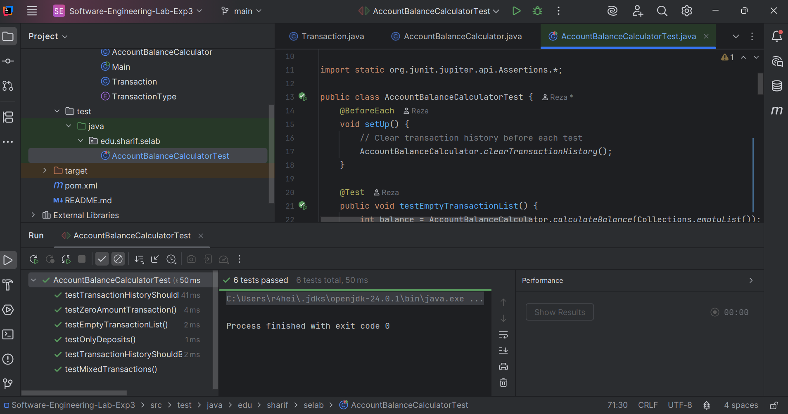
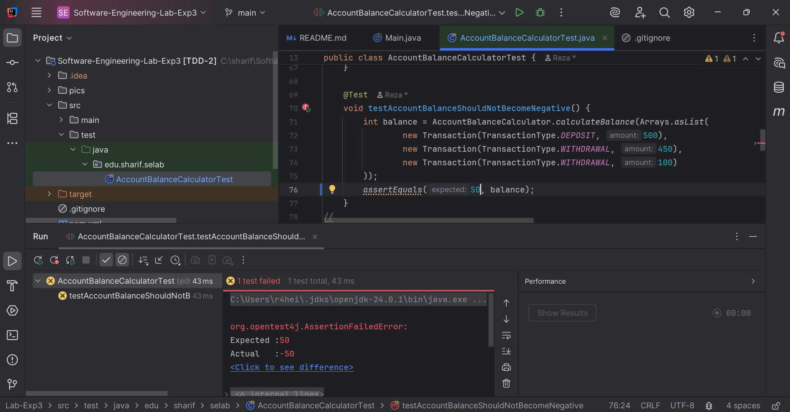
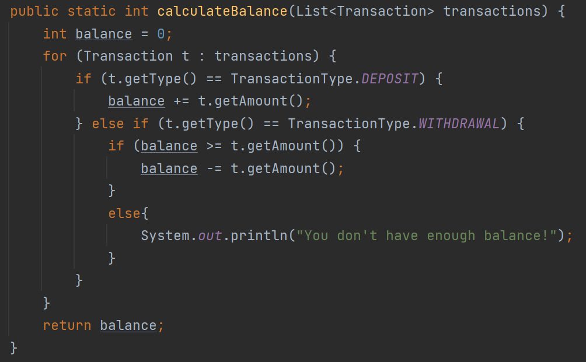
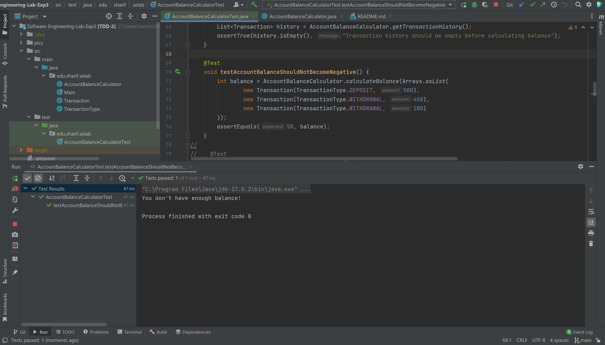
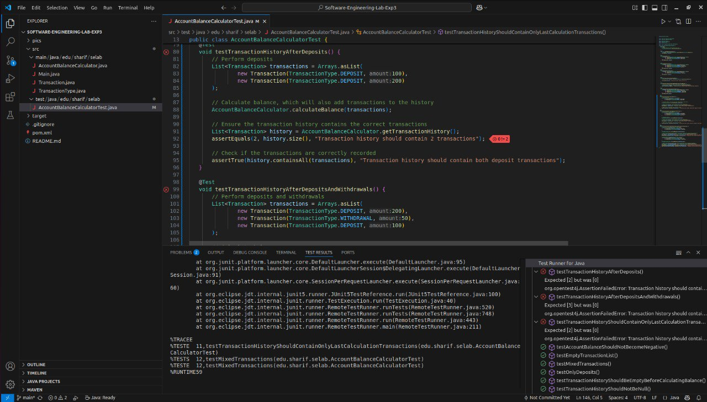
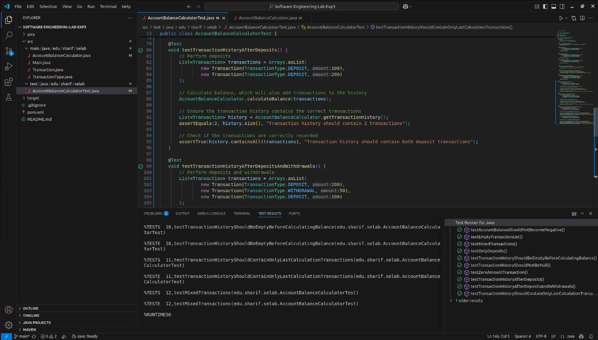

# آزمایش سوم - مدیریت حساب بانکی

## بخش اول

### پرسش اول
در کد داده شده خطایی وجود دارد که موجب می‌شود حتی زمانی که موجودی حساب کافی نیست باز هم برداشت انجام شود و در نتیجه موجودی منفی می‌شود. این مشکل در تست‌های موجود بررسی نشده و همان‌طور که در ادامه می‌بینید همه تست‌ها پاس می‌شوند.

### پرسش دوم
حال برای خطا پیدا شده یک تست می‌نویسیم که بیش از اندازه موجودی حساب برداشت انجام بدهد. در واقع 500 تا واریز می‌کنیم و سپس به ترتیب 450 تا و 100 تا برداشت می‌کنیم. همانطور که می‌بینیم این تست پاس نمی‌شود زیرا موجودی در انتها منفی می‌شود.

حال کد را به شکل زیر تغییر می‌دهیم تا این خطا برطرف شود:

در این حالت با منفی شدن موجودی حساب، هشدار می‌دهد و تراکنش را انجام نمی‌دهد. بنابراین تست به صورت زیر بدون مشکل پاس می‌شود:

### پرسش سوم

نوشتن آزمون بعد از کدنویسی ممکن است باعث شود بخش‌هایی از کد تست‌ناپذیر طراحی شوند.  
این رویکرد احتمال کشف دیرهنگام باگ‌ها را افزایش می‌دهد، که هزینه‌ی رفع آن‌ها را بیشتر می‌کند.  
همچنین باعث می‌شود طراحی ماژولار و منعطف از ابتدا شکل نگیرد، چون تمرکز ابتدا روی عملکرد بوده نه تست‌پذیری.

---
## بخش دوم

در بخش اول تست‌ها را از کامنت درمی‌آوریم و مشاهده می‌شود که تست‌ها پاس نمی‌شوند. 

در نسخه اولیه متد `calculateBalance`، فقط عملیات محاسبه موجودی انجام می‌شود و لیست `transactionHistory` به‌روزرسانی نمی‌شود. این در حالی است که در تست‌ها انتظار می‌رود پس از اجرای این متد، تاریخچه تراکنش‌ها شامل تراکنش‌های ورودی باشد. همین عدم به‌روزرسانی باعث می‌شود تست‌هایی که تاریخچه تراکنش‌ها را بررسی می‌کنند، با شکست مواجه شوند. برای پاس شدن باید تابع را به گونه‌ای تغییر دهیم که لیست تراکنش‌ها را بر اساس آخرین محاسبه برگرداند. برای این کار از `addTransaction` کمک می‌گیریم. پس از اعمال تغییرات مشاهده می‌کنیم که تست‌ها پاس می‌شوند.

اکنون تمامی تست‌های داده شده و نوشته شده پاس می‌شوند.

### پرسش چهارم

نوشتن موارد آزمون پیش از شروع کدنویسی باعث شد که نیازمندی‌های عملکردی برنامه از ابتدا به‌صورت دقیق‌تری مشخص شوند. این کار کمک کرد تا درک واضح‌تری از انتظارات از کد داشته باشیم و به جای تمرکز صرف بر پیاده‌سازی، طراحی بهتری برای ساختار برنامه انجام دهیم. 

همچنین وجود تست‌ها از همان ابتدا به عنوان راهنمایی برای مراحل بعدی توسعه عمل کرد و باعث شد که خطاها سریع‌تر شناسایی و برطرف شوند. این روش فرآیند توسعه را منظم‌تر، قابل پیش‌بینی‌تر و در نهایت سریع‌تر کرد، زیرا از دوباره‌کاری و اصلاحات زمان‌بر جلوگیری شد.

### پرسش پنجم

#### مزایای TDD

1. **کیفیت بالاتر کد**
   - باعث می‌شود پیش از کدنویسی به طراحی و نیازها فکر کنید.
   - منجر به کدی تمیز، ماژولار و قابل نگهداری می‌شود.

2. **کاهش باگ‌ها**
   - خطاها در مراحل اولیه توسعه کشف می‌شوند.
   - تست‌های خودکار، اطمینان از عملکرد درست برنامه را فراهم می‌کنند.

3. **طراحی بهتر نرم‌افزار**
   - نوشتن تست‌ها باعث می‌شود طراحی ماژولارتر و قابل توسعه‌تر شود.

4. **مستندسازی رفتار سیستم**
   - تست‌ها به‌عنوان مستندات زنده عمل می‌کنند.

5. **امکان بازسازی مطمئن (Refactoring)**
   - با داشتن تست‌ها، تغییر در کد با اطمینان بیشتری انجام می‌شود.

6. **عیب‌یابی سریع‌تر**
   - به‌دلیل وجود تست‌های دقیق و کوچک، پیدا کردن خطا ساده‌تر است.

#### معایب TDD

1. **نیاز به زمان بیشتر در ابتدا**
   - نوشتن تست قبل از کد، در ابتدای کار زمان بیشتری می‌برد.

2. **اضافه‌بار در پروژه‌های کوچک**
   - برای اسکریپت‌های ساده ممکن است بیش‌از‌حد باشد.

3. **تولید تست‌های بیش از حد**
   - ممکن است وقت زیادی صرف نوشتن تست‌های غیرضروری شود.

4. **احساس اطمینان کاذب**
   - تست‌های ضعیف می‌توانند باعث اطمینان نادرست از صحت کد شوند.

5. **نیاز به نگهداری تست‌ها**
   - با تغییر در کد، تست‌ها هم باید به‌روزرسانی شوند.

